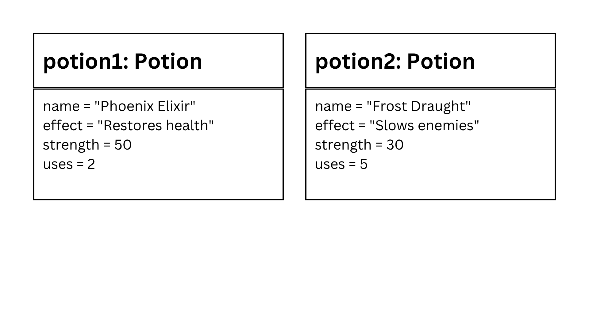

## Design Revision
**Section:** 9 - Platinum  
**Name:** Ace Philip Lee T. Mendoza  
**Date:** September 7, 2026

Changes from my previous design:
- The `uses` attribute was changed from public to private because it should only be changed through the potion's methods.
- The existing properties and methods were kept because they still fit the Potion class.

## Visibility Decisions

| Attribute | Data Type | Visibility | Reason |
|---|---|---|---|
| name | string | Public | Other parts of the program need to identify the potion. |
| effect | string | Public | Other parts of the program may need to know what the potion does. |
| strength | int | Public | The game can access the potion's strength when needed. |
| uses | int | Private | The remaining uses should be protected so they can only be changed safely through methods. |

## Updated UML Class Diagram

## Test Run

## Object Diagram

## Analysis

### 1. Why did you make `uses` private?

I made `uses` private because the number of uses should not be changed directly. It should be controlled by the methods of the class. This helps prevent the value from being changed incorrectly.

### 2. Which method changes the object's state?

The `usePotion()` method changes the object's state by decreasing the number of uses by one. In the test, Potion 1 changed from 3 uses to 2 uses. This shows that the object's data can change when a method is used.

### 3. How do the two objects demonstrate independent state?

The two Potion objects have their own values. When I used Potion 1, its uses decreased from 3 to 2, while Potion 2 remained at 5 uses. This shows that changing one object does not automatically change the other.

### 4. How is the object diagram different from the class diagram?

The class diagram shows the blueprint of the `Potion` class, including its attributes, data types, visibility, and methods. The object diagram shows the actual objects created from the class and their current values. Therefore, the object diagram represents the state of the objects after the test.
