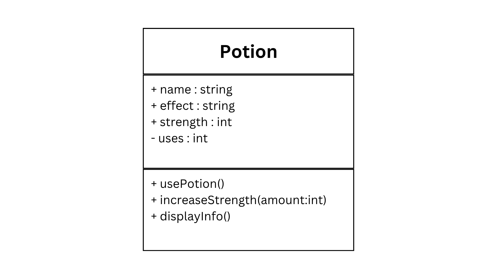
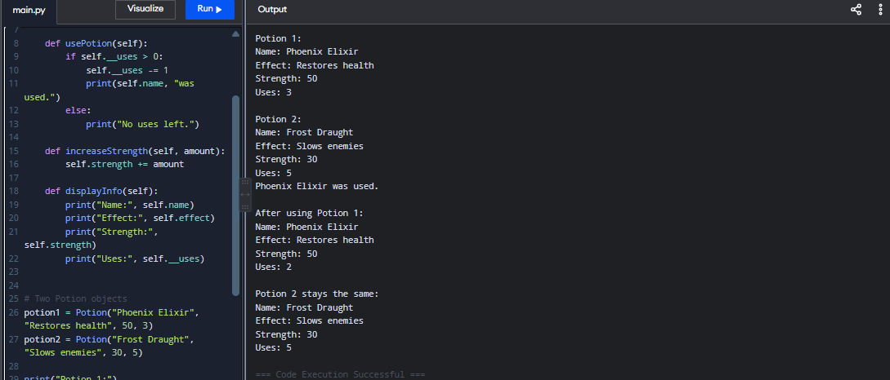

## Design Revision
**Section:** 9 - Platinum  
**Name:** Ace Philip Lee T. Mendoza  
**Date:** August 19, 2026

Changes from my previous design:
- The `uses` attribute was changed from public to private because it should only be changed through the potion's methods.
- The existing properties and methods were kept because they still fit the Potion class.

## Visibility Decisions

| Attribute | Data Type | Visibility | Reason |
|---|---|---|---|
| name | string | Public | Other parts of the program need to identify the potion. |
| effect | string | Public | Other parts of the program may need to know what the potion does. |
| strength | int | Public | The game can access the potion's strength when needed. |
| uses | int | Private | The remaining uses should be protected so they can only be changed safely through methods. |

## Updated UML Class Diagram

## Test Run

