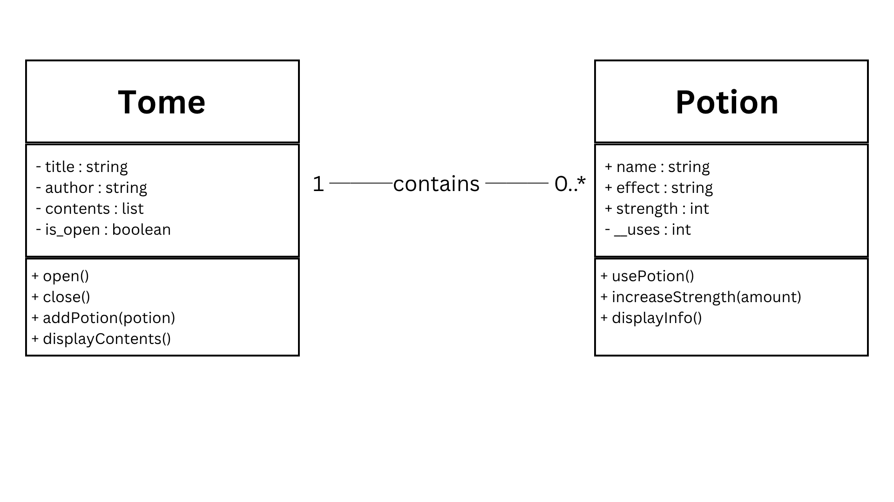
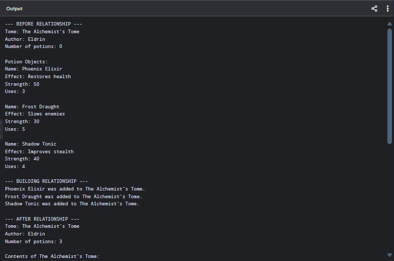
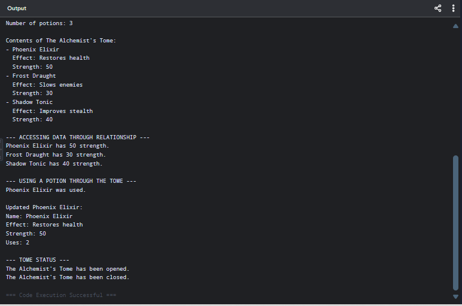
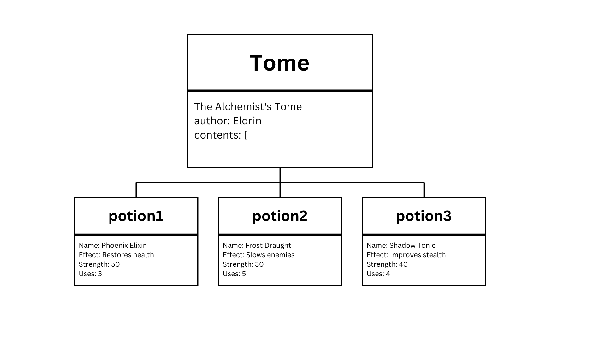

# My OOP Seed System - Part III: Connecting Your Objects

**Section:** 9 - Platinum

**Name:** Ace Philip Lee T. Mendoza

**Date:** September 9, 2026

---

## Step 1 - Review the Existing Class

The existing class from Part II is the `Potion` class. It represents a potion with attributes such as its name, effect, strength, and number of uses. It also contains methods for using a potion, increasing its strength, and displaying its information.

## Step 2 - New Related Class

### 1. New Class Name

**Tome**

### 2. Description

A Tome is a book that stores and manages multiple `Potion` objects. It contains information about the book, such as its title and author, and provides methods for opening, closing, adding potions, and displaying its contents.

### 3. Why Should These Two Classes Be Connected?

A Tome should be connected to the `Potion` class because the Tome is designed to contain and organize multiple potions. Each `Potion` object can be stored inside the Tome, allowing the Tome to manage and access the potions it contains.

## Step 3 - Identify the Association

**Relationship:**
**Tome HAS-A Potion**

**Association:**
**Tome contains Potions.**

**Meaningful Action Phrase:**
**contains**

**Explanation:**
A Tome contains multiple `Potion` objects in its `contents` list. The Tome can add and manage Potion objects through its `addPotion()` method.

## Step 4 - Decide the Multiplicity

**Multiplicity:**
**1 : 0..***

**Explanation:**
One Tome can contain zero or more Potion objects. A Tome can start with no potions and have potions added to it later. The `contents` list allows the Tome to store multiple Potion objects.

## Step 5 - Update the UML Class Diagram

The UML class diagram shows the attributes and methods of both the `Tome` and `Potion` classes. It also shows their association, where one Tome can contain zero or more Potion objects.



## Step 6 - Implement the New Class

The new class I created is `Tome`. It has the attributes `title`, `author`, `contents`, and `is_open`. The class contains methods for opening and closing the Tome, adding Potion objects, and displaying the potions stored inside it.

The `contents` attribute is initialized as an empty list because the Tome will store multiple Potion objects.

## Step 7 - Create the Association in Python

The association is implemented using the `contents` list inside the `Tome` class. The list stores actual `Potion` object references rather than only storing potion names or copied data.

The `addPotion()` method receives a Potion object and adds it to the list using `self.contents.append(potion)`.

```python
def addPotion(self, potion):
    self.contents.append(potion)
    print(potion.name, "was added to", self.title + ".")
```

This creates the relationship between the Tome and the Potion objects because the Tome now contains references to the actual Potion objects.

## Step 8 - Instantiate the Objects

I created one `Tome` object and three different `Potion` objects. The Tome is named **"The Alchemist's Tome"** and its author is **"Eldrin"**.

The three Potion objects are **Phoenix Elixir**, **Frost Draught**, and **Shadow Tonic**. Each potion has different effects, strengths, and numbers of uses.

## Step 9 - Build the Relationship

I built the relationship between the `Tome` and the `Potion` objects by using the `addPotion()` method.

```python
tome.addPotion(potion1)
tome.addPotion(potion2)
tome.addPotion(potion3)
```

These method calls add the three Potion objects to the Tome's `contents` list. This connects the Tome to the actual Potion objects and establishes the `Tome contains Potion` relationship.

## Step 10 - Access Data Through the Relationship

I accessed the Potion data through the relationship by looping through the Tome's `contents` list.

```python
for potion in tome.contents:
    print(potion.name, "has", potion.strength, "strength.")
```

This allows the program to access the `name` and `strength` attributes of the Potion objects stored inside the Tome. This demonstrates that the relationship uses actual Potion object references rather than only storing copied information.

## Step 11 - Produce the Test Run

The test run demonstrates the relationship before, during, and after the Potion objects are added to the Tome. It also demonstrates accessing Potion data through the relationship and using a Potion object through the Tome.





The test run successfully showed that the Tome initially contained zero potions, then contained three Potion objects after the relationship was established.

## Step 12 - Create the Object Relationship Diagram

The object relationship diagram represents the actual objects created in the program. It shows the `tome` object connected to the three Potion objects, `potion1`, `potion2`, and `potion3`, through the `contains` relationship.



## Step 13 - Short Analysis

### Association

The association between the `Tome` and `Potion` classes is a **HAS-A** relationship because a Tome contains Potion objects. The `Tome` class stores references to Potion objects in its `contents` list. The `addPotion()` method allows Potion objects to be added to the Tome, establishing the connection between the two classes.

### Multiplicity

The multiplicity of the relationship is **1 : 0..*** because one Tome can contain zero or more Potion objects. The Tome starts with an empty `contents` list and can have multiple Potion objects added to it. In the test run, one Tome contained three Potion objects.

### Implementation and Testing

The relationship was implemented by storing actual Potion object references in the Tome's `contents` list. The test run showed that the Tome initially contained zero potions and contained three potions after the relationship was built. The program also successfully accessed Potion data and used a Potion through the Tome, demonstrating that the object relationship works correctly.
