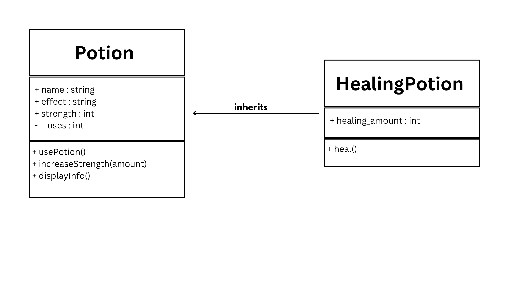

# Advanced Class Relationships

**Section:** 9 - Platinum

**Name:** Ace Philip Lee T. Mendoza

**Date:** September 19, 2026

---

## Step 1 - Review Your Existing System

### 1. What Classes Currently Exist?

The current system contains two classes:

* `Potion`
* `Tome`

The `Potion` class represents individual potions and contains attributes such as name, effect, strength, and number of uses. The `Tome` class represents a book that stores and manages multiple `Potion` objects.

### 2. What Problem or Limitation Exists in the Current Design?

One limitation is that the current system only has a basic association between `Tome` and `Potion`. The system does not yet use inheritance to represent different types of potions, so creating specialized potion types as completely separate classes could result in repeated code. The system can also be improved by explicitly modeling the aggregation relationship between the `Tome` and the existing `Potion` objects.

---

## Step 3 - Create a Child Class

**Parent Class:**
`Potion`

**Child Class:**
`HealingPotion`

**Why is the child a type of the parent?**

A `HealingPotion` is a type of `Potion` because it has the same basic characteristics and behaviors as a regular `Potion`. It has a name, effect, strength, and number of uses, and it can use the methods inherited from the `Potion` class. The `HealingPotion` class is more specific because it also has an additional attribute, `healing_amount`, and a `heal()` method for its specialized function.

---

## Step 6 - Add Aggregation

**My chosen relationship:**
Aggregation

**Class containing another object:**
`Tome`

**Contained object:**
`Potion`

**Why?**

The relationship between `Tome` and `Potion` is aggregation because the `Potion` objects can exist independently from the `Tome`. The `Potion` objects are created separately and are then added to the `Tome` through the `addPotion()` method. The `Tome` stores references to the existing `Potion` objects, but it does not create or control their existence.

---

## Step 8 - Dependency

A Dependency relationship was not implemented because the required advanced relationships have already been completed. The system contains an inheritance relationship between `Potion` and `HealingPotion` and an aggregation relationship between `Tome` and `Potion`.

---

## Advanced UML Diagrams

.png)

---

## Reflection

### 1. Why did you choose your inheritance relationship? Explain why your child class is a type of your parent class.

I chose `HealingPotion` as the child class of `Potion` because a `HealingPotion` is a specific type of `Potion`. It has the same basic properties and behaviors as a `Potion`, such as its name, effect, strength, uses, and ability to display its information. `HealingPotion` also has its own additional attribute, `healing_amount`, and its own `heal()` method.

### 2. How did inheritance reduce duplicate code? Identify attributes or methods that were reused.

Inheritance reduced duplicate code because `HealingPotion` does not need to redefine the attributes and methods already found in `Potion`. It reuses the `name`, `effect`, `strength`, and `uses` attributes through `super().__init__()`. It also inherits methods such as `usePotion()`, `increaseStrength()`, and `displayInfo()`, allowing the child class to focus only on its additional healing functionality.

### 3. Why is your HAS-A relationship Composition or Aggregation? Explain the lifecycle relationship between the two objects.

My HAS-A relationship is Aggregation because the `Tome` receives `Potion` objects that already exist independently. The potions are created before they are added to the `Tome` using `addPotion()`. Therefore, the potions can still exist even if the `Tome` is removed from the system. The `Tome` only stores and connects to the existing `Potion` objects.

### 4. What is the difference between Association from Part III and the advanced relationship you implemented?

Association from Part III showed that classes could be connected or interact with each other. In Part IV, the relationships are more specific because the system now uses inheritance and aggregation. `HealingPotion` inherits features from `Potion`, while `Tome` aggregates existing `Potion` objects. These relationships communicate more information about how the classes and objects are related.

### 5. How does your design follow the DRY principle?

My design follows the DRY principle because common `Potion` code is written only once in the `Potion` parent class. `HealingPotion` reuses that code through inheritance and `super().__init__()` instead of repeating the same attributes and initialization. This makes the system easier to maintain and allows new `Potion` subclasses to reuse the existing functionality.
